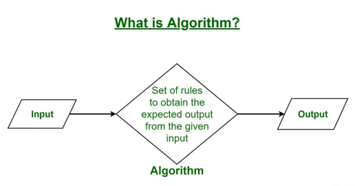

**Algorithm** is a step-by-step procedure for solving a problem or accomplishing a task. In the context of data structures and algorithms, it is a set of well-defined instructions for performing a specific computational task. Algorithms are fundamental to computer science and play a very important role in designing efficient solutions for various problems. Understanding algorithms is essential for anyone interested in mastering data structures and algorithms.

## **What is an Algorithm?**

An **algorithm** is a finite sequence of well-defined instructions that can be used to solve a computational problem. It provides a step-by-step procedure that convert an input into a desired output.

Algorithms typically follow a logical structure:

**· Input:** The algorithm receives input data.  
**· Processing:** The algorithm performs a series of operations on the input data.  
**· Output:** The algorithm produces the desired output.

## **What is the Need for Algorithms?**

Algorithms are essential for solving complex computational problems efficiently and effectively. They provide a systematic approach to:

**· Solving problems:** Algorithms break down problems into smaller, manageable steps.  
**· Optimizing solutions:** Algorithms find the best or near-optimal solutions to problems.  
**· Automating tasks:** Algorithms can automate repetitive or complex tasks, saving time and effort.

## **Use of the Algorithms:**

Algorithms play a crucial role in various fields and have many applications. Some of the key areas where algorithms are used include:

**1\. Computer Science:** Algorithms form the basis of computer programming and are used to solve problems ranging from simple sorting and searching to complex tasks such as artificial intelligence and machine learning.  
**2\. Mathematics:** Algorithms are used to solve mathematical problems, such as finding the optimal solution to a system of linear equations or finding the shortest path in a graph.  
**3\. Operations Research**: Algorithms are used to optimize and make decisions in fields such as transportation, logistics, and resource allocation.  
**4\. Artificial Intelligence:** Algorithms are the foundation of artificial intelligence and machine learning, and are used to develop intelligent systems that can perform tasks such as image recognition, natural language processing, and decision-making.  
**5\. Data Science:** Algorithms are used to analyze, process, and extract insights from large amounts of data in fields such as marketing, finance, and healthcare.  
These are just a few examples of the many applications of algorithms. The use of algorithms is continually expanding as new technologies and fields emerge, making it a vital component of modern society.

##

## **Advantages of Algorithms:**

· It is easy to understand.  
· An algorithm is a step-wise representation of a solution to a given problem.  
· In an Algorithm the problem is broken down into smaller pieces or steps hence, it is easier for the programmer to convert it into an actual program.

## **Disadvantages of Algorithms:**

· Writing an algorithm takes a long time so it is time-consuming.  
· Understanding complex logic through algorithms can be very difficult.  
· Branching and Looping statements are difficult to show in Algorithms**(imp)**.

## **How to Design an Algorithm?**

To write an algorithm, the following things are needed as a pre-requisite:

1\. The **problem** that is to be solved by this algorithm i.e. clear problem definition.  
2\. The **constraints** of the problem must be considered while solving the problem.  
3\. The **input** to be taken to solve the problem.  
4\. The **output** is to be expected when the problem is solved.  
5\. The **solution** to this problem is within the given constraints.  
Then the algorithm is written with the help of the above parameters such that it solves the problem.

**Example:** Consider the example to add three numbers and print the sum.

## **How to analyze an Algorithm?**

For a standard algorithm to be good, it must be efficient. Hence the efficiency of an algorithm must be checked and maintained. It can be in two stages:

### **1\. Priori Analysis:**

“Priori” means “before”. Hence Priori analysis means checking the algorithm before its implementation. In this, the algorithm is checked when it is written in the form of theoretical steps. This Efficiency of an algorithm is measured by assuming that all other factors, for example, processor speed, are constant and have no effect on the implementation. This is done usually by the algorithm designer. This analysis is independent of the type of hardware and language of the compiler. It gives the approximate answers for the complexity of the program.

### **2\. Posterior Analysis:**

“Posterior” means “after”. Hence Posterior analysis means checking the algorithm after its implementation. In this, the algorithm is checked by implementing it in any programming language and executing it. This analysis helps to get the actual and real analysis report about correctness(for every possible input/s if it shows/returns correct output or not), space required, time consumed, etc. That is, it is dependent on the language of the compiler and the type of hardware used.

## **What is Algorithm complexity and how to find it?**

An algorithm is defined as complex based on the amount of Space and Time it consumes. Hence the Complexity of an algorithm refers to the measure of the time that it will need to execute and get the expected output, and the Space it will need to store all the data (input, temporary data, and output). Hence these two factors define the efficiency of an algorithm.  
**The two factors of Algorithm Complexity are:**

**· Time Factor**: Time is measured by counting the number of key operations such as comparisons in the sorting algorithm.  
**· Space Factor**: Space is measured by counting the maximum memory space required by the algorithm to run/execute.

Therefore the **complexity of an algorithm can be divided into two types**:

**1\. Space Complexity:** The space complexity of an algorithm refers to the amount of memory required by the algorithm to store the variables and get the result. This can be for inputs, temporary operations, or outputs.

**How to calculate Space Complexity?**  
The space complexity of an algorithm is calculated by determining the following 2 components:

**· Fixed Part:** This refers to the space that is required by the algorithm. For example, input variables, output variables, program size, etc.  
**· Variable Part:** This refers to the space that can be different based on the implementation of the algorithm. For example, temporary variables, dynamic memory allocation, recursion stack space, etc.  
Therefore Space complexity **S(P)** of any algorithm P is **S(P) \= C \+ SP(I)**, where C is the fixed part and S(I) is the variable part of the algorithm, which depends on instance characteristic I.  
**Example:** Consider the below algorithm for Linear Search

_Step 1: START_  
_Step 2: Get n elements of the array in arr and the number to be searched in x_  
_Step 3: Start from the leftmost element of arr\[\] and one by one compare x with each element of arr\[\]_  
_Step 4: If x matches with an element, Print True._  
_Step 5: If x doesn’t match with any of the elements, Print False._  
_Step 6: END_  
_Here, There are 2 variables arr\[\], and x, where the arr\[\] is the variable part of n elements and x is the fixed part. Hence S(P) \= 1+n. So, the space complexity depends on n(number of elements). Now, space depends on data types of given variables and constant types and it will be multiplied accordingly._

**2\. Time Complexity:** The time complexity of an algorithm refers to the amount of time required by the algorithm to execute and get the result. This can be for normal operations, conditional if-else statements, loop statements, etc.

**How to Calculate**, **Time Complexity?**  
The time complexity of an algorithm is also calculated by determining the following 2 components:

**· Constant time part:** Any instruction that is executed just once comes in this part. For example, input, output, if-else, switch, arithmetic operations, etc.  
**· Variable Time Part:** Any instruction that is executed more than once, say n times, comes in this part. For example, loops, recursion, etc.  
Therefore Time complexity T(P) _T_(_P_) of any algorithm P is **T(P) \= C \+ TP(I)**, where C is the constant time part and TP(I) is the variable part of the algorithm, which depends on the instance characteristic I.  
**Example:** In the algorithm of Linear Search above, the time complexity is calculated as follows:

_Step 1: –Constant Time_  
_Step 2: — Variable Time (Taking n inputs)_  
_Step 3: –Variable Time (Till the length of the Array (n) or the index of the found element)_  
_Step 4: –Constant Time_  
_Step 5: –Constant Time_  
_Step 6: –Constant Time_  
_Hence, T(P) \= 1 \+ n \+ n(1 \+ 1\) \+ 1 \= 2 \+ 3n, which can be said as T(n)._

## **How to express an Algorithm?**

**1\. Natural Language:-** Here we express the Algorithm in the natural English language. It is too hard to understand the algorithm from it.  
**2\. Flowchart:-** Here we express the Algorithm by making agraphical/pictorial representation of it. It is easier to understand than Natural Language.  
**3\. Pseudo Code:-** Here we express the Algorithm in the form of annotations and informative text written in plain English which is very much similar to the real code but as it has no syntax like any of the programming languages, it can’t be compiled or interpreted by the computer. It is the best way to express an algorithm because it can be understood by even a layman with some school-level knowledge.
