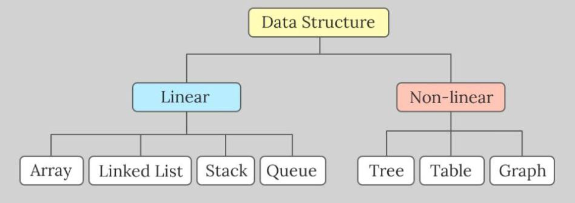
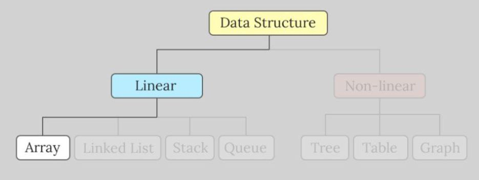

## Data Structures

Data Structure fall into two categories: linear and non-linear. In linear data structures,
elements are arranged sequentially one after the other. Nonlinear data structures
contain elements that do not have a positional order.

## Array Data Structure

An array is a collection of elements accessible by index.
