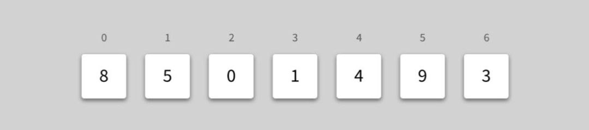
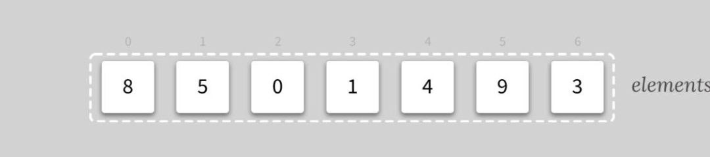
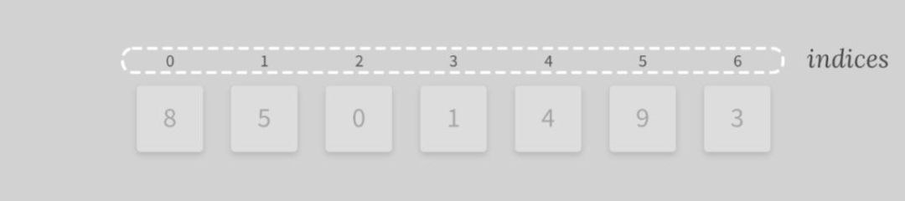
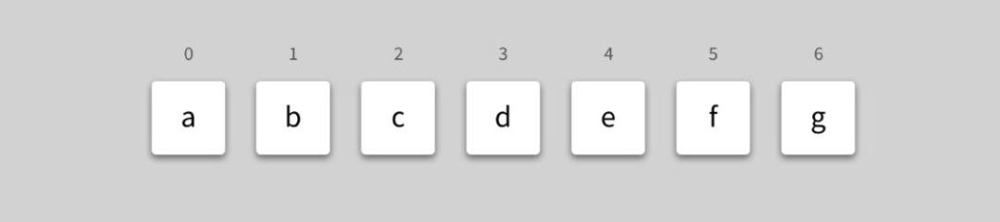
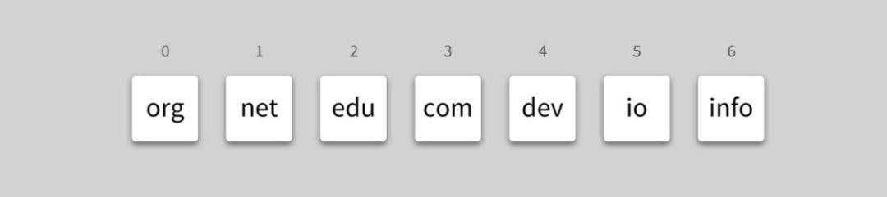

Let's consider the array of integers [8, 5, 0, 1, 4, 9, 3].

---

The items of an arrays are called elements.

---

Each array element has an integer index associated with it. Most languages use
what called a zero-based index, which means that the first element in the array is
at index 0, the second at index 1, and so on.

---

Arrays can be of different types. You can have an array of **_characters._**

---

An array of **_strings_**, and so on.
