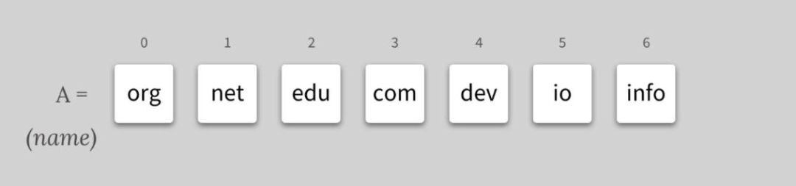
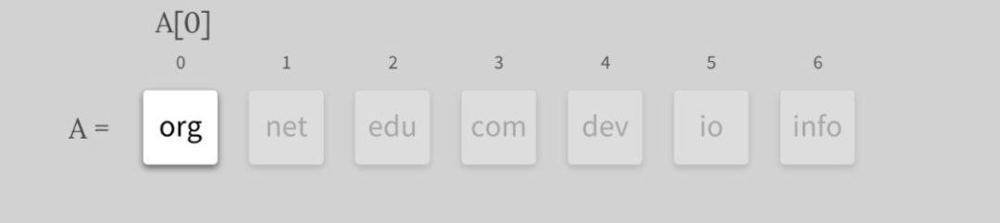
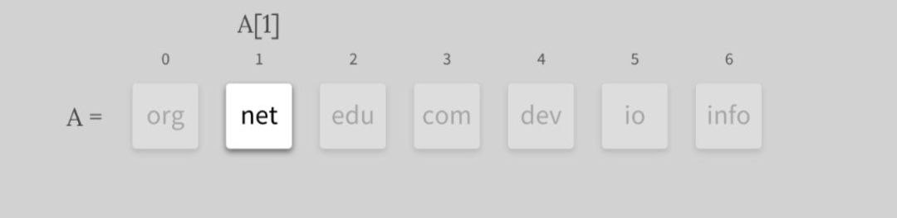
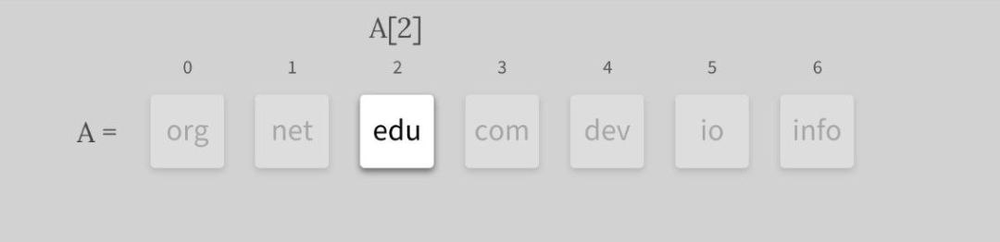
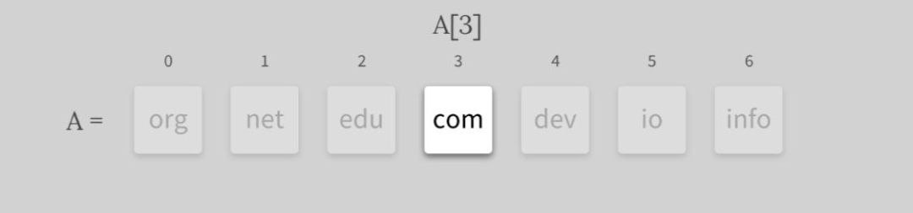
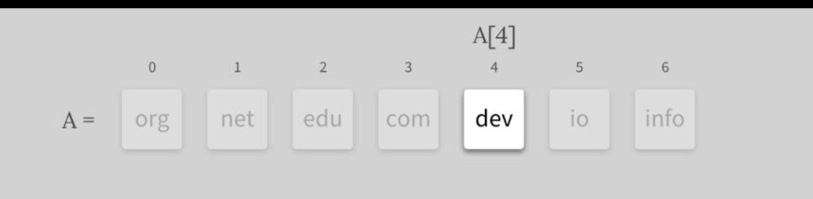
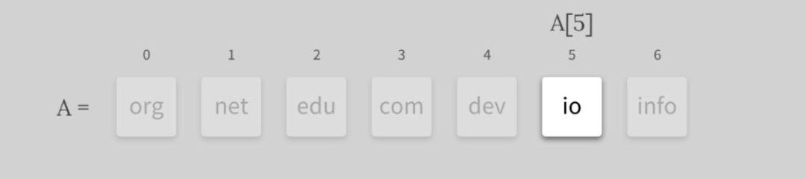
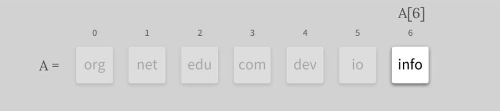
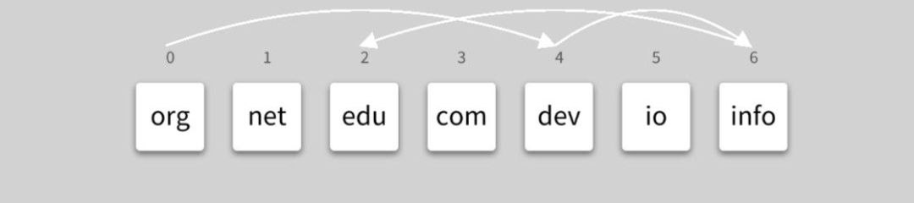

All elements share a common array name. Let's "A" be the name of the given array
(please note that we use this name only for simplicity - in a real program,
we would name the array with the given values like "domains" or "domainNames", etc.)

---

Each element can be accessed by its index number. To access a specific
array position, we use square brackets, passing in the index of the position
we would like to access.

---

Arrays provide **_random access_**. It means that elements can be accessed in arbitrary order.
