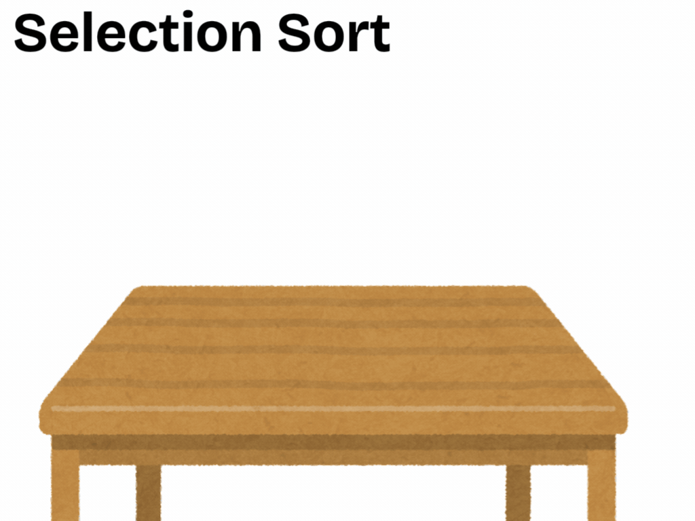

## Selection & Insertion Sort



**Selection Sort** works by repeatedly finding the smallest (or largest)
element in the unsorted part of the array and moving it to the sorted
part.

- It is like choosing the smallest glass of juice from all and placing
  it at the front.

**Insertion Sort**, on the other hand, builds the final sorted array one
element at a time.

- It is like arranging glasses one by one in the correct order, similar
  to arranging playing cards in your hand.

---

### Steps of Selection Sort:

- Find the smallest element in the unsorted portion.
- Swap it with the first unsorted element.
- Move the boundary between sorted and unsorted.
- Repeat until the entire array is sorted.

**Java Example:**

```java
int[] arr = {5, 3, 8, 4, 2};
for (int i = 0; i < arr.length - 1; i++) {
    int minIndex = i;
    for (int j = i + 1; j < arr.length; j++) {
        if (arr[j] < arr[minIndex]) {
            minIndex = j;
        }
    }
    int temp = arr[minIndex];
    arr[minIndex] = arr[i];
    arr[i] = temp;
}
```

Complexity: O(n²), but fewer swaps compared to Bubble Sort.

---

### Steps of Insertion Sort:

- Start with the second element.
- Compare it with the previous elements.
- Shift larger elements to the right.
- Insert the current element into its correct position.
- Repeat for all elements.

**Java Example:**

```java
int[] arr = {5, 3, 8, 4, 2};
for (int i = 1; i < arr.length; i++) {
    int key = arr[i];
    int j = i - 1;
    while (j >= 0 && arr[j] > key) {
        arr[j + 1] = arr[j];
        j--;
    }
    arr[j + 1] = key;
}
```

Complexity: Performs well on small or nearly sorted arrays. Worst:
O(n²), Best: O(n).
